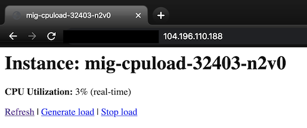

# mig-cpuload

Tool for testing Google Cloud autoscaling that generates VM instance CPU load on demand. 
* Builds docker image and pushes it to current project Container Registry
* Creates Managed Instance Group (MIG) with instance template, autoscaling and health-checks for autohealing
* Each instance listens on external IP HTTP port for allowing you to:
  * Generate/stop 100% CPU load on each instance
  * Make unhealthy - disabling health-checks to test autohealing
* You can adjust settings (`CONFIG` file) for your testing:
  * Machine type used in MIG (smaller bigger CPU/Memory)
  * Initialization time to simulate apps that require long time to start serving
  * Autoscaler configuration

Follow instructions below and watch your MIG autoscale based on the load you generate. Change load and see how MIG autoscaler reacts.

## Getting started

1. Open [Cloud Shell](https://cloud.google.com/shell/docs/using-cloud-shell) or your favorite terminal that has gcloud/docker/make installed.

2. Clone this repo

```shell
git clone https://github.com/epnasis/mig-cpuload.git
cd mig-cpuload/
```

3. Skip this step if using [Cloud Shell](https://cloud.google.com/shell/docs/using-cloud-shell). Otherwise export your Google Cloud project to `GOOGLE_CLOUD_PROJECT`

```shell
export GOOGLE_CLOUD_PROJECT=<your_project_here>
```

4. Create new autoscaled MIG for testing:

```shell
make
```

(Optional) Repeat `make` command to create more MIGs. You can adjust CONFIG file if you want to change `MACHINE_TYPE` or other MIG/autoscaler configuration.

5. Connect to your MIG instance using your browser to generate/stop load and test autoscaler features.


Click "Generate load" to create 100% utilization. Click "Stop load" to kill load at any time. Repeat for as many instances as you need in your testing scenario. You can also make instance unhealthy (disable health-checks) to trigger autohealing.



6. Once done remove created resources with:

```shell
make clean
```

## Contact

In case of questions contact [pwenda@google.com](mailto:pwenda@google.com)

